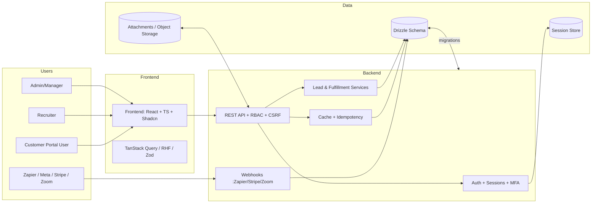
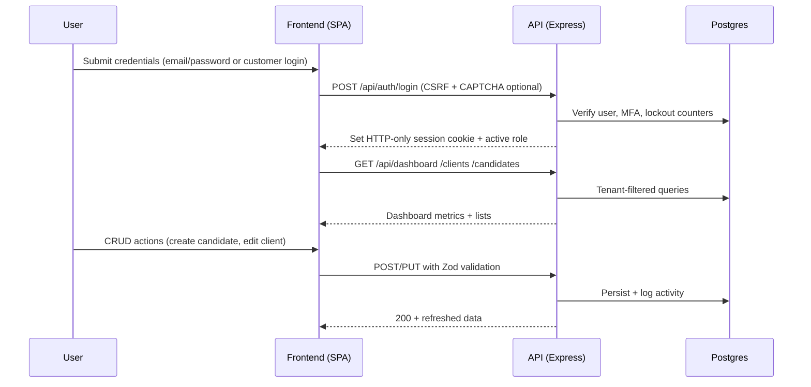
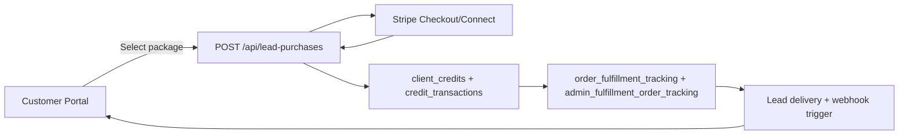
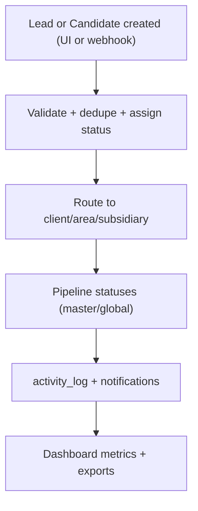
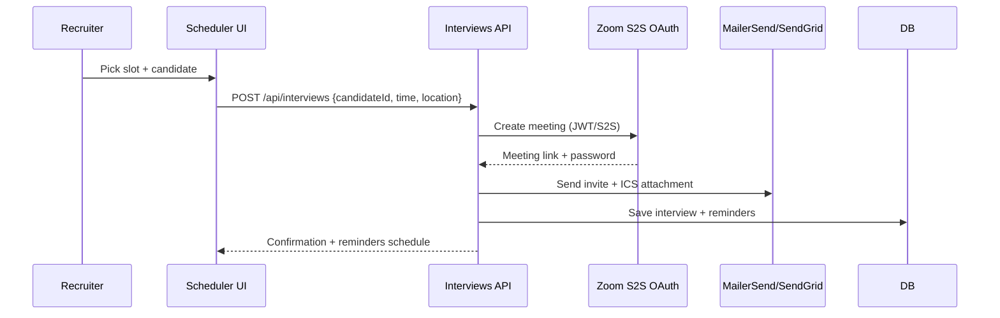
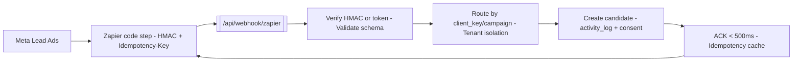
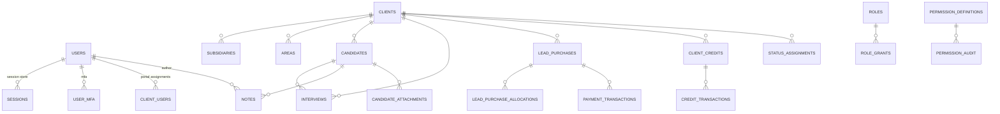

# Career Driver HQ – Platform Documentation

Comprehensive documentation for the Career Driver HQ (CDHQ) multi-tenant recruitment and lead marketplace platform. This README consolidates architecture, database, API, frontend, feature, DevOps, security, and user guidance into a single, production-grade reference.

## 🧱 1. System Overview & Architecture

### ✔ 1.1 High-Level System Overview
- Purpose: End-to-end ATS and lead marketplace for CDL-focused agencies, supporting employee (Admin/Manager/Recruiter) and customer portals with strict tenant isolation.
- Core modules: Admin console, Recruiter workspace, Customer Portal, Lead Purchasing/Credits, Interview Scheduling, Candidate & Client management, Webhooks/Integrations (Zapier, Meta Lead Ads, Zoom, Stripe, RingCentral, MailerSend).
- Multi-tenant model: Client-scoped data with optional subsidiaries/areas; isolation enforced in middleware + SQL filters; invitation codes for onboarding; support for legacy role flags plus RBAC permission graph.
- Roles & permissions: System roles (Admin, Manager, Recruiter, User) and customer roles (Admin/Manager/Viewer) with granular permission keys (135+) and scoped grants (own/team/org/global). MFA, account lockout, CAPTCHA, and CSRF are available on auth flows.

### ✔ 1.2 System Architecture Diagram


### ✔ 1.3 Data Flow Diagrams
- Login → Dashboard → CRUD

- Lead purchase flow

- Candidate management flow

- Interview scheduling flow

- Webhook flow (Meta → Zapier → CDHQ)


## 🗂 2. Database Documentation

### ✔ 2.1 Database Schema Overview
- Storage: PostgreSQL with Drizzle ORM; migrations via `drizzle-kit push`.
- Tenancy: `client_id` present on most domain tables; subsidiary + area hierarchy for routing.
- Auditing: `activity_log`, `permission_audit`, webhook + call logs.
- Payments & credits: Stripe + credit ledger tables, lead fulfillment tracking with FIFO safeguards.
- ER overview:


### ✔ 2.2 Table Documentation (purpose, key columns, relations, constraints)
- **Authentication & Identity**
  - `sessions`: Express session store; `sid` PK; indexed expiry.
  - `users`: Core user profile with legacy `role` plus `roles[]` and `activeRole`; approval workflow; FK self refs for reviewer; tenant-neutral.
  - `user_mfa`: TOTP secrets, recovery codes; unique `user_id` FK → users; enables MFA enforcement.
  - `password_reset_tokens`: Token hash with expiry and consumption timestamps; FK → users; indexed on token hash/user/expiry.
  - `agent_phone_numbers`: Multiple RingCentral numbers per user; FK → users; flags for default/active.
  - `system_settings`: KV store for platform flags; PK on `key`.

- **Organization & Tenancy**
  - `clients`: Tenant root; budgets, lead caps, Stripe customer/connect IDs, invitation codes, credit balances; FK reviewers to users; status + archival fields.
  - `subsidiaries`: Optional child entities under client; unique `(client_id, name/code)`; FK → clients.
  - `client_users`: Many-to-many user↔client with role + status; FKs → users, clients.
  - `client_invitations`: Portal invites with token/expiry; FK → clients and inviting user.
  - `client_contacts`: Contact directory; FKs → clients, optional primary flags; unique email per client.
  - `hiring_managers`: Hiring managers per client; FK → clients; contact fields.
  - `subsidiary_hiring_managers`: Map hiring managers to subsidiaries; FK → both.
  - `areas`: Geographic/territory segmentation; FK → clients; optional hiring manager email; unique name per client; stores geo metadata and caps.
  - `dashboard_cards`: Configurable dashboard widgets; FK → clients; visibility and layout metadata.
  - `job_postings`: Client jobs; titles, compensation, requirements, application URL; FK → clients; status fields.

- **Status & Workflow Configuration**
  - `global_statuses`: Global canonical statuses for reuse; FK createdBy → users.
  - `master_statuses`: Client-scoped status definitions; FK → clients and creators.
  - `status_configs`: Client + area + hiring manager-specific rules; FK → clients/areas/hiringManagers; holds pipelines.
  - `statuses`: Actual status entries tied to candidates; FK → master_status/status_config/candidate.
  - `status_assignments`: Assign statuses to candidates; FK → candidates, statuses, users; audit fields.

- **Candidates, Interviews, Activity**
  - `candidates`: Core candidate profile (contact, license, location, source, ownership, approvals, routing, marketing metadata); FK → clients, areas, subsidiary; indexing on email/phone/search.
  - `candidate_profiles`: Extended attributes and enrichment; FK → candidates.
  - `notes`: Rich notes with visibility, pinned flags; FK → candidates, users.
  - `candidate_attachments`: Uploaded files; FK → candidates and uploader; status for processing.
  - `interviews`: Scheduled interviews; FK → candidates, clients, interviewer (user), area/subsidiary; stores Zoom/meeting info, timezone, outcomes.
  - `interview_records`: History of interview events; FK → interviews and users.
  - `activity_log`: Auditable activity with actor, entity type/id, metadata; indexed timestamps.

- **Lead Purchasing, Credits, Fulfillment**
  - `lead_pricing`: Pricing catalog per client/area/lead type; FK → clients; currency + tiering fields.
  - `lead_purchases`: Lead orders; FK → clients, purchaser (user); quantity, amount, status, Stripe ids; approval and fulfillment flags.
  - `lead_purchase_allocations`: Allocation of purchased leads; FK → lead_purchases and candidate; prevents over-fulfillment.
  - `lead_purchase_attachments`: Supporting docs; FK → lead_purchases and uploader.
  - `order_fulfillment_tracking`: Atomic fulfillment state; FK → lead_purchases; ensures FIFO and prevents double delivery.
  - `admin_fulfillment_orders` / `admin_fulfillment_order_tracking`: Back-office fulfillment and audit trail; FK → users, lead_purchases.
  - `client_credits`: Running credit balance per client; FK → clients; current balance tracked.
  - `credit_transactions`: Ledger of credit earns/spends/refunds; FK → clients and user; immutable amounts.
  - `payment_transactions`: Stripe payments; FK → lead_purchases, clients; status normalized (pending/paid/failed/refunded).
  - `stripe_invoices`: Invoice snapshots; FK → clients and optional lead_purchase; stores PDF link and totals.
  - `stripe_sync_jobs`: Sync runs for billing; status + error logs.

- **Targeting, Qualification, Licenses**
  - `license_types`: CDL license metadata; pre-seeded; referenced by candidates.
  - `targeting_questions`: Configurable screening questions; FK → clients.
  - `qualification_profiles`: Reusable qualification templates; FK → clients; includes scoring and required docs.
  - `client_targeting_responses`: Responses per client candidate; FK → candidates, clients, questions/profiles.

- **Notifications & Communication**
  - `notifications`: Outbound events configuration; FK → clients; channels, triggers, templates; default configs derived from shared notification config.
  - `notification_preferences`: User-level channel preferences; FK → users.
  - `ringcentral_call_logs`: Telephony logs with duration, disposition; FK → users/candidates/clients.
  - `outbound_events`: Webhook events queue (Zapier etc.); tracks retries, status, payload hash.
  - `webhook_test_logs`: Test webhook captures; FK → users; useful for QA.
  - `conversations`, `conversation_turns`, `ai_conversation_insights`: Call/chat transcripts, speaker turns, AI scoring; FK → clients/candidates; supports QA/analytics.

- **Platform Integrations & Imports**
  - `platform_integrations`: External integrations per client (Indeed, Meta, Zoom, Outlook, etc.); stores tokens/configs.
  - `platform_candidates`: Imported candidates from platforms; FK → clients; dedupe keys.
  - `spreadsheet_imports`: Bulk import jobs; FK → clients/uploader; status counters and mappings.
  - `idempotency_keys`: Idempotency ledger for webhook + payment flows; unique key enforced; expiry.

- **RBAC**
  - `roles`: Legacy/system roles; still present for backward compatibility.
  - `teams`: Team containers (optional client FK) for scoped permissions.
  - `permission_definitions`: Master registry of permission keys + scope defaults; unique key.
  - `role_grants`: Role→permission mappings with scope and enable flag.
  - `permission_audit`: Audit trail for permission changes; FK actor → users.

- **Compliance, Privacy, Risk**
  - `consent_records`: TCPA/GDPR consent with channel, source, expiry; FK → candidates/clients.
  - `suppression_lists`: DNC suppression with scope and expiry; used in outreach gates.
  - `eeoc_data`: Voluntary diversity fields; FK → candidates.
  - `bias_check_results`: Content bias analysis results; FK → job_postings or templates; stores scores.
  - `retention_policies`: Data retention policies; applied per entity type.
  - `privacy_requests`: DSAR/erasure/opt-out tracking; FK → users/clients/candidates.
  - `data_inventory`: Records of data categories/processors for compliance.
  - `data_breach_logs`: Incident log with timeline/actions; for compliance.
  - `privacy_policy_versions`: Versioned policies with acceptance tracking.
  - `cookie_consents`: Cookie banner consents per user/session.
  - `anonymization_records`: Tracks anonymization jobs and status.

- **Campaigns, Jobs, Applications**
  - `campaign_routing`: Lead routing rules by source/campaign/ad set; FK → clients/areas.
  - `campaign_events`: Event log for campaigns; FK → job_campaigns/leads.
  - `jobs`: Job catalog; FK → clients; ties to applications.
  - `job_campaigns`: Distribution of jobs to channels; FK → jobs.
  - `applications`: Candidate applications; FK → candidates/jobs; statuses + scores.

- **Support & Ops**
  - `support_requests`: Customer support tickets; FK → client/user; severity/state.
  - `notifications` (above) doubles for ops alerts.
  - `order_fulfillment_tracking`, `admin_fulfillment_order_tracking` (above) for ops reliability.

Constraints/Triggers: Integrity enforced via FK/unique indexes; no DB triggers—business rules handled in services (idempotency, capacity reservation, FIFO fulfillment).

### ✔ 2.3 Query Performance
- Index strategy: email/phone search on candidates; expiry on sessions/password tokens; composite uniques on subsidiaries (client+name/code), contacts (client+email), idempotency keys; timestamps on activity/log tables.
- Pagination: offset/limit with stable ordering (`created_at desc`); cursor pagination available for some lists via `id`.
- Large-table patterns: `dashboard` metrics cached; `activity_log` and webhook logs with selective projections; background exports streamed.
- Migrations: Managed via Drizzle; apply with `npm run db:push` or `make db-push`; `db-reset` (Make) forces a rebuild for local/test environments only.

## 🔌 3. API Documentation

### ✔ 3.1 API Structure
- Base URL (production): `https://careerdriverhq.com` (Replit-hosted); Dev: `http://localhost:5000`.
- Path prefix: REST under `/api/*`; health under `/health`, `/healthz`, `/ready`.
- Authentication:
  - Employee portal: Session cookie via `/api/auth/login` or `/api/email/login` (CSRF + optional CAPTCHA, MFA, lockout after 5 failed attempts).
  - Customer portal: `/api/customer/login`, `/api/customer/register`, invitation-code onboarding.
  - Unified auth: `/api/auth/unified-login` supports role switching; CSRF token required for mutating calls.
  - RBAC middleware enforces permission scopes (own/team/org/global).
- Error responses: Standard JSON
```json
{
  "error": {
    "code": "VALIDATION_ERROR|AUTHENTICATION_ERROR|AUTHORIZATION_ERROR|... ",
    "message": "Readable message",
    "details": {},
    "suggestion": "Actionable hint",
    "supportId": "ERR-<timestamp>-<random>"
  }
}
```
- Content types: JSON for APIs; multipart for uploads; ICS for calendar responses.

### ✔ 3.2 Endpoint Documentation (representative, most common routes)
- **Health & Monitoring**
  - `GET /health`, `/healthz`, `/ready`, `/.well-known/ready` → status payload; no auth.
  - `GET /api/version` → git/version info.
  - `GET /api/monitoring/metrics` → performance stats (secured).

- **Auth**
  - `POST /api/auth/login` (email/pass) → session cookie; body `{ email, password, mfaCode? }`; errors: 401/429 lockout.
  - `POST /api/auth/logout` → clears session.
  - `GET /api/auth/user` → current user + roles/permissions.
  - `POST /api/email/login`, `/api/email/register`, `/api/auth/password/reset`, `/api/auth/password/change` → email flows with rate limits.
  - `POST /api/customer/login`, `/api/customer/register`, `/api/customer/logout` → portal auth; returns customer session.
  - `POST /api/auth/unified-login` → resolves correct portal + role.

- **Candidates**
  - `GET /api/candidates` → paginated list (tenant-filtered); supports search (name, email, phone), status filters.
  - `POST /api/candidates` → create; body validated by `insertCandidateSchema`; auto-assign status/area.
  - `GET /api/candidates/:id` → detail with notes, attachments, activity, statuses.
  - `PUT /api/candidates/:id` → update fields, status changes, ownership; logs activity.
  - `POST /api/candidates/:id/notes` → add note; `POST /api/candidates/:id/attachments` → upload; `POST /api/candidates/:id/status` → change status with reason.
  - Errors: 403 on tenant/permission mismatch, 409 on duplicates if idempotency key reused.

- **Clients & Areas**
  - `GET /api/clients` → list with budgets/credits; filter by active/archived.
  - `POST /api/clients` → create client (Admin); sets invitation code, lead caps.
  - `GET /api/clients/:id` / `PUT /api/clients/:id` → detail/update including settings and default invite email.
  - `GET/POST/PUT /api/clients/:clientId/areas` → manage territories; includes caps + hiring manager; guards ensure tenant isolation.
  - `GET /api/clients/:clientId/contacts` / `POST` / `PATCH /set-primary` → contact directory.
  - `GET /api/clients/:clientId/dashboard/*` → stats, activities.
  - `GET /api/clients/:clientId/subsidiaries` / `POST` / `PUT` → subsidiary CRUD.

- **Interviews & Scheduling**
  - `GET /api/interviews` (or scoped to client) → upcoming/past; filter by status/candidate.
  - `POST /api/interviews` → schedule; body `insertInterviewSchema`; optionally creates Zoom link and ICS; triggers email invite.
  - `POST /api/interviews/:id/reschedule|cancel|complete` → update status + send notifications.
  - `GET /api/zoom/authorize` / `POST /api/zoom/webhook` → Zoom S2S OAuth + webhook handling.

- **Lead Purchasing & Credits**
  - `GET /api/lead-purchases` → list purchases; filter by status/client.
  - `POST /api/lead-purchases` → initiate purchase; handles pricing lookup, idempotency, capacity reservation.
  - `POST /api/lead-purchases/:id/checkout` → Stripe checkout session; returns client secret/publishable key.
  - `GET /api/lead-purchases/:id/allocations` → fulfillment state.
  - `GET /api/clients/:clientId/payment-history` → invoice/payment ledger.
  - `POST /api/stripe/webhook` → payment events; validates signature.

- **Admin & Settings**
  - `GET /api/admin/settings` / `PUT /api/admin/settings` → system-level settings, notification defaults.
  - `GET /api/admin/users` / `POST` / `PUT` → manage employees; set active role.
  - `GET /api/admin/phone-numbers` → RingCentral pool; assign to users.
  - `POST /api/admin/jobs` / `POST /api/admin/job-postings` → job posting + distribution.
  - `GET /api/admin/privacy/*` → privacy dashboards (if compliance feature on).

- **RBAC**
  - `GET /api/permissions` → list registry.
  - `GET /api/permissions/user/:userId` → effective permissions.
  - `POST /api/permissions/role-grants` → update role grants.
  - `POST /api/permissions/user-overrides` → overrides (feature-flagged).
  - `GET /api/permissions/audit` → audit log.

- **Integrations & Webhooks**
  - `POST /api/webhook/zapier` → HMAC/token auth; idempotent; events `candidate.created|interview.scheduled|ping`.
  - `POST /api/webhook/test` → webhook lab for debugging (secured).
  - `POST /api/webhook/meta` (via Zapier) → Meta Lead Ads ingestion (through `/webhook/zapier`).
  - `GET /api/zoom/oauth` / `POST /api/zoom/webhook` → Zoom integration.
  - `GET /api/platform/integrations` / `POST` → manage external connectors (Stripe, RingCentral, MailerSend, Outlook).

- **Misc/Support**
  - `POST /api/support/requests` → create support ticket.
  - `GET /api/imports` / `POST /api/imports` → spreadsheet import jobs.
  - `GET /api/reports/dashboard` → reporting dashboard metrics (cached).

Responses use consistent structure; successful responses return resource payloads with `requestId` for traceability where applicable.

### ✔ 3.3 Rate Limits, Pagination, Filtering Rules
- Rate limiting: Authentication endpoints throttled (lockout after 5 failures; 429 on abuse). Webhooks enforce idempotency TTL (24h) and concurrency guards. Optional global 100 requests/15min per IP (configurable).
- Pagination: `page`/`limit` or `offset`/`limit`; default 25; max 100. `sortBy`/`sortDir` guarded to whitelist columns.
- Filtering: Candidates/clients/interviews support status/date range/search query filters; filters must pass Zod schemas to avoid injection. Multi-tenant filters auto-applied server-side.

## 🎨 4. Frontend Documentation (React + Shadcn UI)

### ✔ 4.1 Component Structure
- Location: `client/src/components` for reusable UI; `pages` for route-level; `hooks` for shared logic; `lib` for helpers.
- State: TanStack Query for server state; local component state kept minimal. Queries keyed by tenant/client/role where applicable.
- Forms: React Hook Form + Zod schemas from `shared/` for validation parity with server.
- Layout: Sidebar + top header; modals for CRUD; drawers for quick views; toasts for confirmations/errors.
- Routing: Wouter with guarded routes; portal-aware navigation; feature flags hide unavailable modules.
- React Query standards: cacheTime tuned per resource (dashboard shorter, reference data longer); invalidate on mutations; use `select` for shape trimming.

### ✔ 4.2 UI Component Library
- Shadcn-based primitives: buttons, inputs, selects, dialogs, tabs, accordions, toasts.
- Reusable composites: tables with virtualized rows, paginated footers, filters; cards for metrics; loaders/skeletons; sidebar navigation; header breadcrumbs; pagination + empty states.
- Theming: Tailwind with tokens; typography + spacing aligned with design tokens; support for customer branding.

### ✔ 4.3 Pages Documentation
- Dashboard: client and global stats, budget/lead cap tiles, activity feed.
- Candidate List & Detail: filters, bulk actions, status changes, notes, attachments, communication log.
- Interview Scheduler: calendar view, availability slots, Zoom links, ICS download, reminder settings.
- Client Management: client overview, subsidiaries, contacts, area budgets, permissions, credit balances.
- Lead Purchases: marketplace catalog, checkout, invoices, fulfillment tracker, refund/adjustment flows.
- Settings: profile + MFA, notification preferences, roles/permissions (manager delegation), phone numbers.
- Customer Portal: registration/onboarding, lead purchases, purchased lead list, candidate feedback, invoice history.
- Admin Tools: system settings, RBAC management, job postings, compliance dashboards (feature-flagged).

### ✔ 4.4 Form Standards
- Validation: Zod schemas shared with backend; inline errors near fields; disable submit while loading; optimistic UI only when idempotent.
- Error patterns: toast for global errors; inline for field-level; show `supportId` when present.
- UX: auto-focus first invalid field; preserve user input on failures; confirmation dialogs for destructive actions; mask sensitive inputs.

## 🧩 5. Module Documentation (Feature-Level)

### ✔ 5.1 Candidate Management
- Fields: contact info, license/endorsements, location, source, campaign, area, owner, status, approval state, tags, documents, activity log.
- Status flow: 8-stage pipeline (New Lead → Contacted → Qualified → Interview Scheduled → Interviewed → Offer Extended → Hired → Archived) with client-specific overrides.
- Creation flow: UI form or webhook; dedupe on email/phone; auto-assign area/status; optional enrichment; audit log per change.
- Logs: notes, attachments, call logs, status changes; activity log persists actor + metadata; export via CSV.

### ✔ 5.2 Client Management
- Client setup: name, contacts, budgets/lead caps, branding, default invite sender, Stripe customer/connect IDs.
- Permissions: client_users with roles; RBAC scopes applied through middleware; manager delegation supported.
- Area permissions: areas tied to subsidiaries/hiring managers; caps and routing per area; visibility filtering in UI/API.

### ✔ 5.3 Lead Purchasing
- Stripe integration: checkout + Connect (20% platform fee configurable); webhook-driven status updates; invoices stored.
- Credits logic: `client_credits` + `credit_transactions`; purchases decrement, refunds credit back; ledger immutable.
- Flow: purchase request → pricing validation → payment intent/session → idempotency key stored → on success allocate leads and trigger fulfillment → deliver leads via portal + optional webhook/email.
- Safeguards: idempotent checkout, capacity reservation, FIFO fulfillment (`order_fulfillment_tracking`), duplicate detection.

### ✔ 5.4 Interview Scheduler
- Zoom S2S OAuth with refresh and webhook handling; fallback manual link supported.
- ICS/calendar generation for invites; timezone-aware scheduling.
- Reminders: email templates via MailerSend/SendGrid; configurable offsets; audit in `activity_log`.
- Notifications: candidate + hiring manager + recruiter; meeting updates on reschedule/cancel.

### ✔ 5.5 Integrations
- Zapier: `/api/webhook/zapier` with HMAC SHA256, token fallback, idempotency TTL 24h; fast ACK and replay-safe.
- Meta Lead Ads: Supported via Zapier code step; campaign routing via `campaign_routing`.
- Zoom: Meeting creation/webhooks; ICS attachments.
- MailerSend: Email delivery for invites/notifications; templated.
- RingCentral: Click-to-call + logs; multiple numbers per user.
- Stripe: Billing, Connect, invoices; webhook signature verification; publishable/secret key resolution by mode.
- Outlook/Microsoft Graph: Email sending (configured).

### ✔ 5.6 Admin Settings
- Roles & permissions: manage role grants, permission registry, audit trail; manager delegation UI.
- Job postings: create/publish jobs; bias check results stored when compliance enabled.
- Phone numbers: manage RingCentral pool and assignments.
- System configuration: feature flags, notification defaults, maintenance mode, support contact.
- Compliance: consent/suppression, privacy requests, retention settings (feature-flagged).

## 🧰 6. DevOps, Infrastructure & Deployment

### ✔ 6.1 Replit Environment Setup
- Prerequisites: Node.js 20+, PostgreSQL 16+ (Neon or local), npm.
- Steps:
  1) `cp .env.example .env` and populate secrets.
  2) Install: `npm ci --legacy-peer-deps` or `make install`.
  3) Push schema: `make db-push` (uses Drizzle).
  4) Start dev: `make dev` (Vite + Express on port 5000, frontend served via Express).
- Replit hosting: uses provided `.replit`/`replit.nix` defaults; environment variables stored in Replit Secrets; health endpoints for uptime monitors.

### ✔ 6.2 Version Control Workflow
- Branching: feature branches off `main`; imperative commits (e.g., `Add candidate importer`).
- PRs: link issues, summarize change, list commands run (`make lint`, `make type-check`, `make test`), attach screenshots/API responses for UI/API.
- Releases: enable feature flags gradually; migrations via `make db-push` before deploy.

### ✔ 6.3 Environment Variables (key set)
- Database: `DATABASE_URL` (required).
- Auth/Sessions: `SESSION_SECRET` (required), `REPLIT_DOMAINS`, `NODE_ENV`, `PORT`, `BCRYPT_ROUNDS`, `JWT_EXPIRY`.
- Core keys: `OPENAI_API_KEY` (AI features), `STRIPE_SECRET_KEY`, `STRIPE_PUBLISHABLE_KEY`, `STRIPE_WEBHOOK_SECRET`, `STRIPE_CONNECT_CLIENT_ID`.
- Email: `MAILERSEND_API_KEY`, `MAILERSEND_FROM_EMAIL/NAME`, `SENDGRID_API_KEY`, `SENDGRID_FROM_EMAIL`.
- Telephony: `TWILIO_*`, `RINGCENTRAL_*`, `VITE_RC_ADAPTER_SRC`.
- Video: `ZOOM_API_KEY/SECRET/WEBHOOK_SECRET`, `MS_TEAMS_*`.
- Feature flags: `FEATURE_CRM`, `FEATURE_REPORTS`, `FEATURE_INTEGRATIONS`, `FEATURE_CX`, `FEATURE_COMPLIANCE`, `FEATURE_POSTHIRE`, `FEATURE_QA_CALLS`, `FEATURE_BILLING`, `FEATURE_FUELCARDS`, `FEATURE_AGENT_OPS`.
- Compliance/Monitoring: `TCPA_CONSENT_REQUIRED`, `EEOC_REPORTING_ENABLED`, `SENTRY_DSN`, `SENTRY_TRACES_SAMPLE_RATE`, `SLOW_QUERY_THRESHOLD_MS`.
- Security: `RATE_LIMIT_WINDOW_MS`, `RATE_LIMIT_MAX_REQUESTS`, `CORS_ORIGINS`, `CSP_REPORT_URI`, `CSP_REPORT_ONLY`.
- Integrations/Exports: `ZAPIER_WEBHOOK_URL`, `HR_EXPORT_*`, `BACKGROUND_CHECK_PROVIDER`, `AI_MODEL`, etc. (see `.env.example` for full list).

### ✔ 6.4 Deployment Guide
- Build: `make build` (Vite + esbuild bundled server). Output in `dist/`.
- Run prod: `make start` or `NODE_ENV=production node dist/index.js`.
- Docker: `docker-compose up --build` for dev stack; `docker build -t career-driver-hq .` + `docker run -p 5000:5000 --env-file .env career-driver-hq` for prod image.
- CI/CD: GitHub Actions run lint/type-check/format/test/build; dependabot/audit in pipeline. E2E via Playwright on demand.
- Rollback: redeploy previous image + restore DB snapshot; feature flags can disable modules without rollback.

### ✔ 6.5 Backups
- Database: daily snapshots recommended (Neon/PG logical backups); store retention aligned to `GDPR_RETENTION_DAYS`.
- Restore: apply snapshot, run `make db-push` for schema alignment, replay webhook/payment events via idempotency keys if needed.
- Attachments: back up object storage paths (`PRIVATE_OBJECT_DIR`, `PUBLIC_OBJECT_SEARCH_PATHS`) when used.

## 🔒 7. Security Documentation
- Authentication: email/password + optional Replit OIDC; MFA via TOTP; session cookies HttpOnly/SameSite; account lockout after 5 failed logins; CAPTCHA support on auth endpoints.
- Authorization: legacy roles + RBAC permission engine (135 permissions, scoped grants); middleware enforces tenant isolation and CSRF; manager delegation restricted to allowed scopes.
- Input validation: Zod on all APIs; server-side sanitization; Drizzle parameterization prevents SQL injection.
- Security headers: Helmet baseline, CSP configurable (`CSP_REPORT_URI`, report-only toggle), CORS allowlist, HSTS in production.
- Rate limiting: configurable window/max; applied to auth and webhook endpoints; idempotency keys for write operations and webhooks.
- Data protection: PII encryption at rest (database-level), TLS in transit; anonymization/retention policies; audit logs for permission changes and data access.
- External allowlists: Stripe, Zoom, MailerSend/Microsoft Graph endpoints allowed; webhook receivers restricted; SSRF-safe outbound calls with timeouts.

## 📘 8. User-Facing Manuals
- Employee Portal (Admin/Manager/Recruiter):
  - Login at `/login`; switch role when multiple roles exist.
  - Use Dashboard for KPIs; Candidates for pipeline actions; Interviews for scheduling; Clients/Areas for tenant config; Lead Purchases for manual orders; Settings for MFA and notifications.
  - Permission errors show `supportId`; contact admin with code.
- Customer Portal:
  - Register at `/portal/register` or join via invitation code; login at `/portal/login`.
  - Purchase leads, view purchased leads, download invoices, provide feedback on leads, manage basic candidate info if allowed.
  - Billing uses Stripe; ensure payment method saved for faster checkout.
- Admin Guide:
  - Configure feature flags and system settings; seed permissions via RBAC UI; manage phone numbers; set default invite sender; enforce compliance flags.
  - Monitor `Permissions Audit`, `Activity Log`, `Webhook Test Logs`, `RingCentral Call Logs`.
  - Run health checks `/healthz` and dashboard caches for performance; trigger webhook tests via webhook lab.
- Troubleshooting:
  - Auth issues: verify `SESSION_SECRET`, CORS origins, CAPTCHA keys; check lockout counters; inspect logs with `supportId`.
  - Stripe issues: confirm publishable/secret keys match mode; verify webhook secret; check `stripe_sync_jobs` for failures.
  - Webhook duplicates: confirm idempotency key uniqueness; check `idempotency_keys` table; ensure campaign routing rules present.
  - Slow queries: increase indexes or review `SLOW_QUERY_THRESHOLD_MS` logs; clear dashboard cache.
  - Builds: clear `node_modules`/`dist` then `npm ci --legacy-peer-deps`; ensure Node 20+.

---

### How to Work With This Repo
- Development commands: `make dev`, `make test`, `make test-e2e`, `make lint`, `make format`, `make type-check`, `make validate`.
- Database: `make db-push`, `make db-reset` (local only).
- Use feature flags to enable in-progress modules safely; never disable tenant isolation or RBAC checks in production.

Built for enterprise-grade, multi-tenant recruitment and lead fulfillment with reliability, security, and clear operability at its core.
